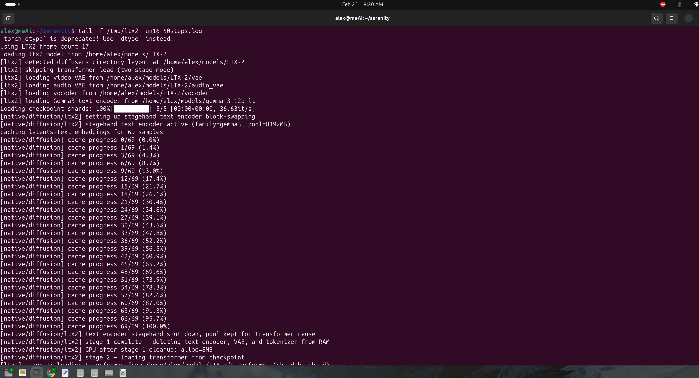
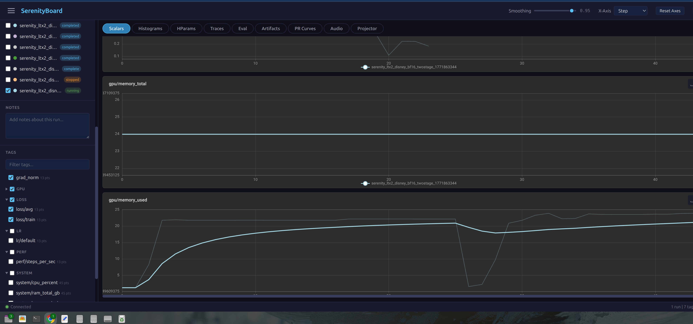
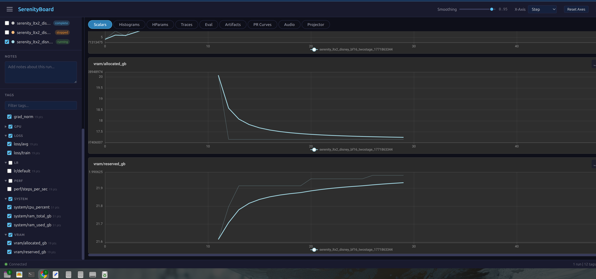
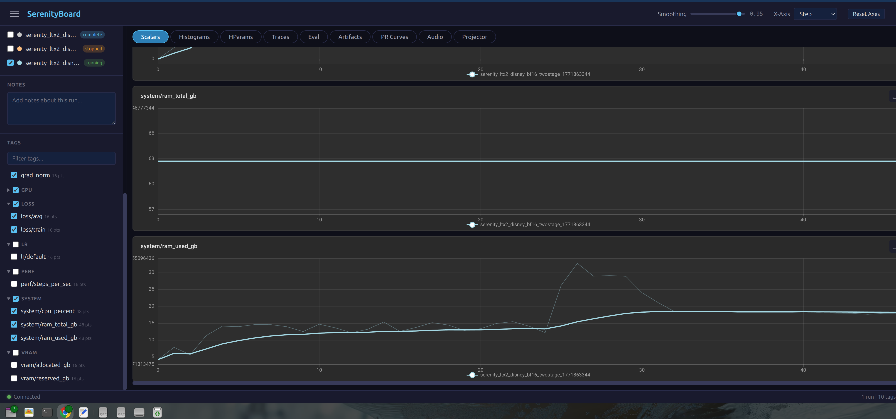

# Case Study: LTX-2 19B Full bf16 Training on 24GB VRAM

Training a 19-billion-parameter video diffusion model (LTX-2) with a 12-billion-parameter text encoder (Gemma 3), all in full bfloat16 precision, on a single 24GB GPU using Stagehand block-swapping.

No quantization. No model sharding across GPUs. One card.

## The Problem

LTX-2 is Lightricks' video generation model. Its components:

| Component | Parameters | bf16 Size |
|-----------|-----------|-----------|
| Transformer (LTXVideoTransformer) | 18.88B | ~37.8 GB |
| Text encoder (Gemma 3 12B-IT) | 12B | ~24 GB |
| Video VAE | ~600M | ~1.2 GB |
| Audio VAE + Vocoder | ~400M | ~0.8 GB |
| **Total** | **~31.9B** | **~63.8 GB** |

The transformer alone doesn't fit in 24GB VRAM. The text encoder alone fills the entire card. Loading both simultaneously is impossible. Full bf16 finetuning of this model was considered a multi-GPU task.

## The Solution: Two-Stage Stagehand

Split training into two stages, each using Stagehand's block-swapping to keep only one transformer block on GPU at a time.

### Stage 1: Cache Text Embeddings

```
Load: Gemma 3 12B text encoder + VAE + audio VAE + vocoder
Strategy: StagehandTextEncoderStrategy (inference mode, block-swap)
Work: Process all training captions through Gemma 3, cache embeddings to disk
```

Gemma 3 has 48 decoder layers. Each layer is ~500MB in bf16. Stagehand streams them through a pinned memory pool one at a time:

1. **before_block** hook fires: load layer weights from CPU pinned slab to GPU
2. Layer's forward pass runs on GPU
3. **after_block** hook fires: evict layer back to CPU, prefetch next layer

After all captions are processed, the text encoder, its Stagehand runtime, and the pinned pool are released. Total CPU RAM freed: ~32GB.


*Terminal showing stage 1: Gemma 3 loaded with Stagehand block-swapping (pool=8192MB), 69 samples cached, then stage 1 teardown — GPU drops to 8MB before stage 2 begins.*

### Stage 2: Train Transformer with LoRA

```
Load: LTX-2 18.88B transformer from 8 sharded safetensors files
Strategy: StagehandStrategy (training mode, file-backed block-swap)
Work: LoRA fine-tuning with cached text embeddings
```

The transformer has 48 blocks. With file-backed mode, frozen weights stream directly from disk (mmap'd safetensors) through pinned slabs to GPU. Only LoRA adapter weights (rank 32, ~589MB total) persist across steps.

Each training step:
1. **Forward pass**: Stagehand loads blocks sequentially, prefetching 2 ahead. Gradient checkpointing recomputes activations during backward instead of storing them (critical: without it, a single block's activations consume ~22GB).
2. **Backward pass**: Stagehand reloads blocks in reverse order. LoRA gradients accumulate.
3. **Optimizer step**: LoRA params gathered from CPU to GPU, AdamW updates, moved back to CPU.


*Step 12/50 running at 10.64 s/it, loss=1.33, VRAM 17.16/21.80 GB. Stagehand manages blocks transparently — the training loop sees a normal model.*

## Hardware Requirements

| Resource | Minimum | Used |
|----------|---------|------|
| GPU VRAM | 20 GB | 24 GB (RTX 3090/4090) |
| System RAM | 48 GB | 62 GB |
| Disk | SSD recommended | NVMe |

### RAM Budget Breakdown

**Stage 1 peak** (~32 GB):
- Gemma 3 12B weights on CPU: ~24 GB
- Pinned memory pool: 8 GB
- Python/PyTorch overhead: ~4 GB

**Between stages** (~8 GB):
- Text encoder deleted, `gc.collect()` runs
- GPU allocation drops to 8 MB

**Stage 2 peak** (~48 GB):
- Transformer state dict loading (8 shards): ~37.8 GB
- Python/PyTorch overhead + mmap buffers: ~10 GB
- Pinned pool released before transformer load to make room

**Training steady state** (~20 GB CPU + 17 GB GPU):
- Pinned pool: 8 GB
- Model metadata + LoRA weights: ~2 GB
- File-backed weights: streamed from disk, no CPU copy needed

## Training Configuration

```json
{
  "model_type": "ltx2",
  "training_method": "lora",
  "model": {
    "path": "/path/to/LTX-2/",
    "dtype": "bfloat16",
    "text_encoder_model_name": "/path/to/gemma-3-12b-it"
  },
  "adapter": { "rank": 32, "alpha": 32 },
  "memory": {
    "gradient_checkpointing": "on",
    "strategy": "stagehand",
    "stagehand": {
      "two_stage": true,
      "text_encoder_block_swap": true,
      "encoder_family": "gemma3",
      "family": "ltx2",
      "pinned_pool_mb": 8192,
      "pinned_slab_mb": 1024,
      "vram_high_watermark_mb": 20000,
      "vram_low_watermark_mb": 16000,
      "prefetch_window_blocks": 2,
      "max_inflight_transfers": 2
    }
  },
  "resolution": 512,
  "batch_size": 1,
  "data": { "frames": 17 }
}
```

## Results

Training on 69 video clips (512px, 17 frames each), 50 steps, LoRA rank 32.

### Loss Curve

```
Step  1: loss=4.500  grad_norm=0.703  (warmup step, 49s)
Step  5: loss=1.933  grad_norm=2.047
Step 10: loss=1.275  grad_norm=0.766
Step 20: loss=1.046  grad_norm=0.108
Step 30: loss=1.093  grad_norm=0.260
Step 40: loss=1.077  grad_norm=0.220
Step 50: loss=1.080  grad_norm=0.120
```

Loss dropped from 4.50 to ~1.08 over 50 steps. Gradient norms stabilized in the 0.1-0.5 range, indicating healthy convergence without exploding or vanishing gradients.

### Performance

| Metric | Value |
|--------|-------|
| Warmup step (first step, trace pass) | ~49 s |
| Steady-state step | 9.3-9.8 s |
| VRAM allocated (steady state) | 17.2 GB |
| VRAM reserved (steady state) | 21.8-22.0 GB |
| VRAM peak (step 1) | 20.1 GB |
| Stage 1 (cache 69 samples) | ~3 min |
| Stage 2 (50 training steps) | ~7 min |
| Total wall time | ~12 min |
| LoRA output size | 589 MB (2,688 tensors) |

### GPU Memory Profile



The SerenityBoard dashboard captures Stagehand's block-swap pattern in real time.

**gpu/memory_total** holds flat at ~24 GB — the full card capacity.

**gpu/memory_used** tells the story. It starts near zero, then during the first training step (trace pass) climbs rapidly to ~20 GB as Stagehand discovers the execution order. After the trace completes, it settles into a pattern: oscillating between ~5 GB (post-eviction valleys) and ~20 GB (block-loaded peaks). Around step 20 you can see the pattern stabilize as the CUDA caching allocator finds its rhythm, holding steady at 17-20 GB through the remaining steps.

The **grad_norm** chart (top) shows a spike at step 20 (~0.2) then settling to near zero — healthy convergence with no gradient instability.

### VRAM Detail



**vram/allocated_gb** shows the initial peak at ~20 GB (step 1, trace pass) then a gradual decline to a steady 17.3 GB floor by step 20. This floor represents the non-block overhead: normalization layers, projections, LoRA weights, optimizer state, and activation memory. Each block temporarily adds ~3 GB on top during its forward/backward pass.

**vram/reserved_gb** starts at 21.6 GB and rises slightly to 21.9 GB as PyTorch's CUDA caching allocator expands its free pool. The ~4 GB gap between allocated and reserved is recycled memory available for activation tensors without new allocations.

### System RAM Profile



**system/ram_total_gb** is constant at ~63 GB.

**system/ram_used_gb** reveals the two-stage memory lifecycle:
- **Steps 0-10** (stage 1 → stage 2 transition): RAM oscillates between 5-10 GB during text embedding caching with Gemma 3, then spikes sharply as the 37.8 GB transformer state dict loads into RAM around step 10
- **Steps 10-20**: RAM climbs to ~30 GB peak as the state dict is assigned into the model and Stagehand sets up file-backed streaming
- **Steps 20+**: Settles to ~12-15 GB steady state. The state dict is freed, and file-backed weights stream from disk — no CPU copy needed for frozen parameters. The remaining RAM is the pinned pool (8 GB) plus Python overhead

The key insight: after setup, CPU RAM usage is modest because Stagehand's file-backed mode streams frozen weights directly from NVMe to GPU through a fixed pinned buffer pool, bypassing CPU memory entirely.

## Key Stagehand Features Used

### Block-Level Scheduling

Stagehand's scheduler manages the full lifecycle of each transformer block:

```
UNLOADED → HOST_STAGED → PREFETCHING → GPU_READY → EVICTING → HOST_STAGED
                                                   → GPU_FREEING → UNLOADED
```

For file-backed blocks (frozen transformer weights), eviction just frees the GPU tensor. The weights reload from disk on next use. No CPU RAM needed for frozen parameters.

For module-backed blocks (LoRA adapter weights), eviction copies GPU tensors back to CPU. The module's parameters are the only copy of the data, so they must be preserved.

### Budget-Aware Prefetching

Stagehand checks VRAM budget before issuing speculative prefetch loads:

```python
# In the scheduler's prefetch loop:
if not self._budget.can_prefetch():
    break  # VRAM too close to watermark, skip speculative loads
```

This prevents the prefetch window from pushing VRAM over the high watermark and triggering unnecessary eviction cascades. Especially important during backward passes when activation memory is high.

### Module-Backed Direct GPU Load

When a block's parameters exceed the pinned slab size, Stagehand bypasses the normal slab pipeline and loads directly:

1. Build parameter layout from the module
2. Allocate a contiguous GPU tensor sized to hold all parameters
3. Flatten CPU parameters into it via a single H2D copy
4. Restore parameter views pointing into the GPU tensor

This handles the Gemma 3 text encoder blocks (~500 MB each) which are too large for a standard slab but don't have file-backed sources (the text encoder is loaded from HuggingFace format, not safetensors shards).

### Eviction with Module-Backed Preservation

During inference-mode eviction (text encoder caching), module-backed blocks must preserve their weights on CPU:

```python
if is_module_backed and block_size > slab_size:
    # Copy GPU params to CPU (module IS the data source)
    for param in module.parameters():
        param.data = param.data.to("cpu", non_blocking=True).clone()
else:
    # File-backed: just drop GPU tensor, reload from disk later
    _detach_params(module, layout)
```

Without this, eviction would replace parameter data with empty tensors, destroying the only copy of the weights.

## Bugs Fixed Along the Way

Six bugs were identified and fixed to make this work end-to-end:

1. **Gemma 3 block layer detection**: Newer `transformers` package nests layers at `model.language_model.layers`, not `language_model.model.layers`. Stagehand couldn't find the blocks to swap.

2. **Inference eviction destroying module-backed params**: `_detach_params()` replaced all parameter data with `torch.empty(0)`. For module-backed blocks (no file source), this destroyed the only copy of the weights. Second forward pass crashed with shape mismatches.

3. **OOM during transformer loading**: The 8 GB pinned pool from stage 1 wasn't freed before loading the 37.8 GB transformer state dict. 8 + 37.8 + overhead > 62 GB system RAM. Fix: release pool before transformer load.

4. **Missing scheduler on pipeline**: The flow-match loss code needs `pipeline.scheduler.config.num_train_timesteps` to sample timesteps. LTX2Pipeline wasn't constructed with a scheduler.

5. **Gradient checkpointing silently disabled**: `enable_gradient_checkpointing()` raised an exception that was swallowed by `suppress(Exception)`. Without gradient checkpointing, a single block's activations consumed ~22 GB, causing immediate OOM.

6. **Optimizer device mismatch**: After backward, Stagehand evicts blocks to CPU, including LoRA params and their gradients. `optimizer.step()` found optimizer state on CUDA but params on CPU. Fix: gather trainable params to GPU before optimizer step, move back after.

## Reproducing This

This was run with [Serenity](https://github.com/CodeAlexx/Serenity), which integrates Stagehand as its memory management backend. The relevant code paths:

- **Two-stage orchestration**: `serenity/cli/native_diffusion.py`
- **Stagehand strategy wrapper**: `serenity/memory/stagehand_strategy.py`
- **LTX-2 model adapter**: `serenity/models/ltx2.py`
- **Sharded weight loading**: `serenity/models/ltx2_checkpoint.py`

The Stagehand library itself is model-agnostic. Any training framework can use it by:

1. Setting up a `StagehandRuntime` with the model and block pattern
2. Calling `convert_registry_to_file_backed_sharded()` for frozen weight streaming
3. Wrapping forward passes with `runtime.managed_forward()`
4. Handling LoRA param gathering for optimizer steps

## What This Means

A 19B video model + 12B text encoder = 31.9B parameters trained in full bf16 on a single consumer GPU. No quantization artifacts. No multi-GPU coordination overhead. The model sees its weights at full precision every step.

Stagehand makes the GPU/CPU boundary transparent: the training loop doesn't know weights are streaming in and out. It just runs `model(input)` and gets gradients back.

The cost is time: ~9.5 seconds per step instead of ~1-2 seconds with all weights resident. For fine-tuning workloads (50-500 steps), this is a worthwhile trade. A 50-step LoRA fine-tune completes in 12 minutes.
